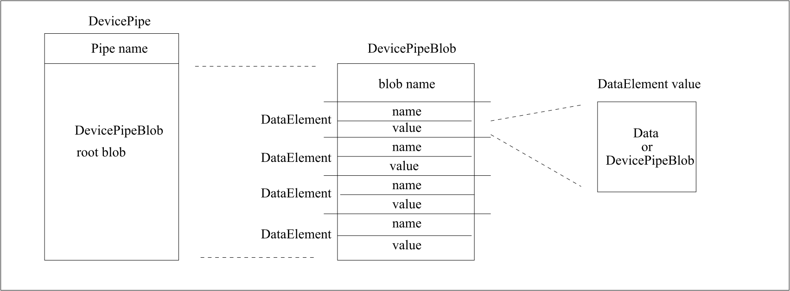

(tango-pipe-model)=
# Pipe

```{tags} audience:all, lang:all
```

:::{warning}
The {term}`Pipe <pipe>` feature will get deprecated when the DevDict feature will be implemented.

PyTango has deprecated the Pipe feature in PyTango 10.0.2 and will remove it in PyTango 10.1.0.
:::


%[glossary_term][pipe]
%A pipe allows to read and/or write structured data from and/or to a {term}`device`. The data consists of one or more basic Tango data types. The structure of the data is defined by a {term}`device class` but is not static. It can be changed at runtime by the {term}`device` itself or modified upon request by a {term}`client` according to the `set_pipe_config` operation provided by pipe. The list of available pipes in a {term}`device` is defined by the {term}`device's <device>` {term}`device class`.

## Introduction
A Tango {term}`Pipe <pipe>` is like an {term}`Attribute <attribute>` with a flexible data structure, name and description.
Unlike {term}`Commands <command>` or {term}`Attributes <attribute>`, a {term}`Pipe <pipe>` does not have a pre-defined data type.
Tango {term}`Pipe <pipe>` data types may be a mixture of the basic Tango data types (or array of) and may change every
time a {term}`pipe <pipe>` is read or written.

## Use Case
In some cases, it is required to exchange data between client and device
of varying data type. This is for instance the case of data gathered
during a scan on one experiment. Because the number of actuators and
sensors involved in the scan may change from one scan to another, it is
not possible to use a well-defined data type. TANGO {term}`Pipes <pipe>` have been
designed for such cases. A TANGO {term}`Pipe <pipe>` is basically a pipe dedicated to
transfer data between client and device.

## Pipe metadata

Tango {term}`Pipes <pipe>` are self-describing entities.
They are defined by three sets of metadata which are always part of the {term}`Pipes <pipe>`:

- Static metadata that defines the {term}`Pipe <pipe>` like:
  - name: the name of the pipe
  - display-level: an enumeration describing the visibility level of the Pipe (EXPERT or OPERATOR)
  - writable: an enumeration describing whether the Pipe is Read only or Read Write
- Dynamic metadata the {term}`Pipe <pipe>`'s:
  - description: a string describing the pipe
  - label: a label which can be used as an alternative name by the clients.
- Runtime metadata describing the {term}`Pipe <pipe>`’s value and its timestamp.

## Pipe data structure

Pipe data structure is of type `DevPipeBlob`, as specified in {doc}`rfc:9/DataTypes`.  See image below.



A DevicePipeBlob is composed of :
- a blob name (a string)
- a set of DataElement objects

DataElement objects are composed of:
- a name: a string containing the name
- The values in the DataElement objects can be of any basic Tango data types (or array of) or can be themselves a DevicePipeBlob.

The number of DataElement and their value types can change at every {term}`Pipe <pipe>` read or write operation.

## More about Pipes

{term}`Pipes <pipe>` metadata (static, dynamic and runtime) are listed in the
{doc}`full specification of Tango Pipes <rfc:7/Pipe>` which is part of the [Tango Controls RFCs](#RFC).
