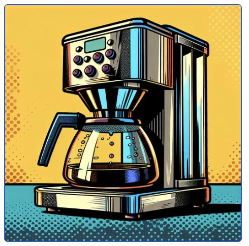

# Coffee Crisis!

To make sure this tutorial isn't *super* boring, imagine you are a new employee at **Tango MegaCorp Inc.** working
in the DevOps team.

On your first day, your manager calls you into her office, with a worried expression on her face.
She explains that the whole organisation's productivity has dropped significantly in the last month.
Luckily, they've figured out that the problem is a lack of coffee for the programmers.
It's a crisis!  It just so happens that a month ago they replaced all the old coffee machines with shiny new
*MegaCorp DC3000* series drip coffee machines.  It's not going well - the machines are often empty or broken down,
instead of having a pot of steaming brew ready at all times.

{w=200px align=center}

She says a control system has to be built to monitor these smart, but temperamental, coffee machines
and keep the java flowing ☕☕☕.  Of course, it has to be built using **Tango Controls**, and it has to be done right away!

With a mixture of nervousness and excitement you offer to tackle this urgent project and rush back to your office.
