(bensikin-manual)=

# Bensikin User Manual

```{tags} audience:all
```

```{rubric} Authors:
```

*R.Girardot, M.Ounsy, A.Buteau, M.Thiam* -
[Soleil](https://www.synchrotron-soleil.fr/en)

## Introduction

This document is an end-user guide to using the {program}`Bensikin` application,
and a brief developer-oriented presentation of the application’s
architecture.

## Application’s context: Contexts and Snapshots

A snapshot is, as said in the name, a “picture” of a list of equipment’s
“settings” (*more precisely of their Tango attributes value*s) taken
at a precise instant.

A snapshot is based on a context, which is a group of Tango devices and
their attributes that must be part of the snapshots. A context is
described by meta-data (author, description, etc.), so that users know
which context is used what for.

A typical use case of a snapshot is to memorize a particular
configuration of a set of equipment’s, to be able in the future to reset
them to the values of this snapshot (*for example, reposition all
Insertion devices to their parking position after a beam loss*).

## Application’s description and goals

### Application’s goals

{program}`Bensikin` allows the user to define contexts and take snapshots.
Snapshots can be saved as files and modified.

Bensikin is ready for multi-user use, which has for consequence the
need to define accounts. An account is a way to map a user with a
working directory. An important consequence of this is that **2
different users must not use the same working directory**, or you
may encounter application misbehaviors. An account has a name and a
path to a working directory.

Bensikin is thus naturally divided (both in functionalities and
display) in three parts:

- The account part, which is an introduction to the rest of the
  : application
- The context part
- The snapshot part

### A first look to Bensikin

The Bensikin Account Manager is here to manage accounts, which
means:

- Creating a new account

- Deleting an existing account

- Launching application with an account chosen in a list

  (bensikin-fig-1)=

  :::{figure} bensikin/image5.png
  Figure 1: Bensikin Account Manager
  :::

The {guilabel}`Context Control Panel` is where user can manage contexts, which means
creating, loading and modifying contexts, and launching snapshots based
on the defined contexts.

The {guilabel}`Snapshot Control` Panel is where user can manage snapshots, which
means saving snapshots in files, loading snapshots from database and
files, temporary modify snapshots attributes values and set equipment
with defined snapshots (with or without modifying snapshots) or a
subpart of them.

The application’s {guilabel}`logs panel` displays the application information and
error messages (like database interaction, encountered problems, etc.)

The {guilabel}`Menu` and the {guilabel}`Tool bar` are for actions shortcuts and application’s
options.

(bensikin-fig-2)=

:::{figure} bensikin/image6.png
Figure 2: Bensikin main panel
:::

## Account Manager

The [Figure 1: Bensikin Account Manager ](#bensikin-fig-1) presents the account Manager
Interface, on application start. With this manager, you can create a new
account, or delete or use an existing one.

To quit the application, simply click on 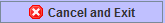 button.

Existing accounts are listed in the account {guilabel}`Selection Combo Box`, which
you can reload by clicking on 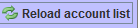 button (if you think that someone
could have modified it by creating a new account or deleting an existing
one, for example).

### Creating a new account

To create a new account, click on the button 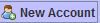 (at the bottom
left of the panel). A new dialog will appear, as following.

(bensikin-fig-3)=

:::{figure} bensikin/image11.png
Figure 3: Creating a new account
:::

In this new dialog, you will have to enter the name of your new
account and the path of the application working directory for this
account. If you prefer, you can browse for the path by clicking on
the 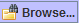 button. Then, a classic browsing dialog will be
displayed, in which you can choose the directory. When both fields
({guilabel}`Name` and {guilabel}`Path`) are fulfilled, click on 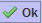 button to
validate your new account, which will be automatically added in the
list of existing accounts. If you click on 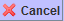
button, you go back to the first dialog, as presented in
[Figure 1: Bensikin Account Manager ](#bensikin-fig-1),
and nothing is done.

### Deleting an existing Account

To delete an existing account, first select the account in the
account selection combo box, as following:

(bensikin-fig-4)=

:::{figure} bensikin/image15.png
Figure 4: Account selection
:::

When the account is selected, click on {guilabel}`Delete` button to delete
it. If you do it, you won’t be able to use this account any more
(and no other user either), because the account is definitely
removed from list. The account deletion doesn’t involve the
corresponding directory (neither its content) deletion.

If you want to see your account path, you can check {guilabel}`Show account
path`.

(bensikin-fig-5)=

:::{figure} bensikin/image5.png
Figure 5: Show account path
:::

### Launching application with an existing account

To launch application with an existing account, first select the
account in the account selection combo box, as presented in
[Figure 4: Account selection ](#bensikin-fig-4).

Then, click on {guilabel}`Ok` button, and you will reach the application
main panel configured with this account (the account name is
displayed in frame title).

## Contexts Management

This section describes how to control contexts with Bensikin. A context
is a list of attributes for which you can make a snapshot. A context has
an ID and a creation date, both defined by the database. A context also
has a name, an author, a reason and a description. The reason usually
describes why the context was created (example: because of an incident
or in order to set some equipment), whereas the description is here to
have an idea of what kind of attributes you will find in this context.

Contexts are managed in the context control panel:

(bensikin-fig-6)=

:::{figure} bensikin/image16.png
Figure 6: Context control panel
:::

### Creating a new context

To create a new context, click on the {guilabel}`new` icon in toolbar
(), or choose option to make a new context from {guilabel}`File` menu
or {guilabel}`Contexts` menu:

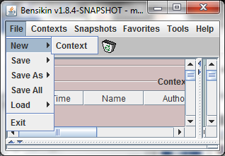 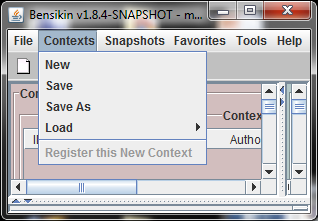

You also are ready to make a new context at application first start
or by clicking on the {guilabel}`reset` icon ():

(bensikin-fig-7)=

:::{figure} bensikin/image21.png
Figure 7: Application first start
:::

The difference between the {guilabel}`reset` icon() and the {guilabel}`new`
icon () is, that the “reset” icon will clear every panel,
whereas the “new” icon will only clear the snapshot list and the
Context Details sub panel.

#### Classic way (tree)

The tree on the left side of the {guilabel}`Context Details` sub panel allows
you to check for available attributes. The one on the right side
represents your context attributes.

To add attributes in your context browse the left tree, select
attributes (represented by the icon ), and click on the
green arrow 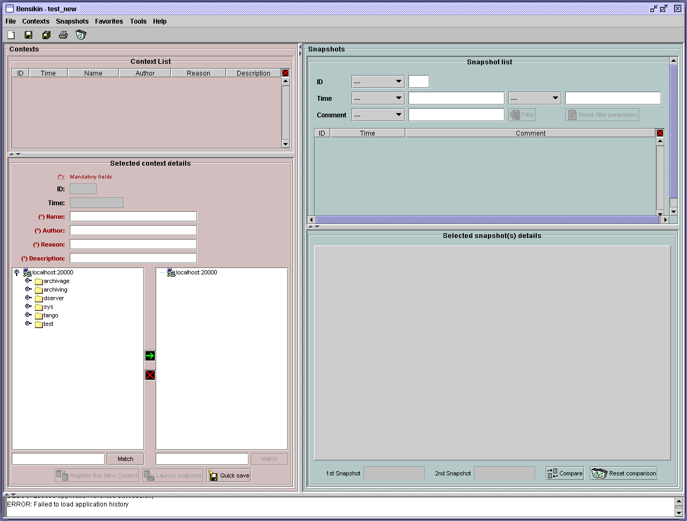 to transfer them to the right tree.

To remove attributes from your context, select them in the right
tree and click on the red cross .

Finally, fill the context Meta data (Name, Author, Reason and
Description) in the corresponding fields (Note that filling the
fields activates the {guilabel}`register` button 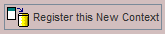).

Then, you can save your context in database by clicking on the
{guilabel}`register` button .

Doing so will deactivate the {guilabel}`register` button and activate the
{guilabel}`launch snapshot` button 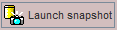.

You can save your context in a file using the {guilabel}`save`
icon .

#### Alternate way (table)

To select this alternate way, go to {guilabel}`tools` menu and select
{guilabel}`options`.

Then select the {guilabel}`context` tab and click on the {guilabel}`table` radio button.

(bensikin-fig-8)=

:::{figure} bensikin/image28.png
Figure 8: Option –context tab
:::

Click on the {guilabel}`ok` button. The context panel now has the “table
selection mode”.

(bensikin-fig-9)=

:::{figure} bensikin/image80.png
Figure 9: Bensikin with context table selection mode (new context)
:::

- Attribute selection and automatic attributes adding:

  - Choose a Domain. This refreshes the list of possible Device
    classes for this Domain.

  - Choose a Device class. This refreshes the list of possible
    Attributes for this Domain and Device class.

  - Choose an Attribute and press {guilabel}`OK`:

    All Attributes with the selected name **AND** belonging to any
    Device of the selected Class and Domain are added to the current
    Context’s list of attributes.

  All new attributes are light red until the Context is registered.

- Line level sub-selection of loaded attributes:

  Each attributes are initially checked, but this check can be removed
  by the user. When the user clicks on {guilabel}`validate`, all unchecked
  attributes will be removed from the current Context.

  - Click {guilabel}`All` to select all lines
  - Click {guilabel}`None` to select no lines
  - Highlight lines in the list (CTRL and SHIFT are usable), then click
    {guilabel}`Reverse highlighted` to reverse the checked/unchecked status of
    all highlighted lines.

As for the classic way, you will have to fill the Meta data fields
and register your context in database by clicking on the {guilabel}`register`
button 

### Modifying an existing context

As a matter of fact, you can’t really “modify” a context. What you
can do is to create a new context with its information (attributes
and Meta data) based on another one.

The very difference is in alternate mode, where former attributes
are in white and new ones in light red:

(bensikin-fig-10)=

:::{figure} bensikin/image81.png
Figure 10: Bensikin with context table selection mode (modified
context)
:::

The “register” button changed a little too: its text is {guilabel}`Register this context`
instead of “Register this new context”, as you can see
on the figure above.

### Loading a context

There are 2 ways to load a context:

- Load it from the database
- Load it from a file

In both cases, loading a context will apply a quick filter on the
snapshot list, so you can see the snapshots about this context that
have been created this day (the day when you load the context).

#### Loading a context from database

In the {guilabel}`Contexts` menu, choose {guilabel}`load` then select {guilabel}`DB`:

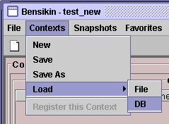

A dialog will then appear to allow you to filter the list of
contexts in database following different criteria:

(bensikin-fig-11)=

:::{figure} bensikin/image32.png
Figure 11: Data base Context filter dialog
:::

Select no criterion to search for all contexts present in database.
Click on the 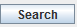 button to apply the filter. The list of
corresponding contexts will then appear in the Context List sub
panel, as shown in [Figure 6: Context control panel ](#bensikin-fig-6). Double click
on a context in table to load it and see its details in the Context
Details sub panel (See [Figure 6: Context control panel ](#bensikin-fig-6)).

If there are too many contexts in the list, you can remove some
contexts from list (not from database) by selecting them in list and
clicking on the cross on the top right corner of the list:
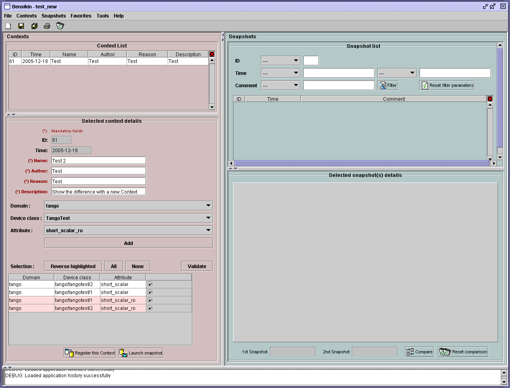

#### Loading a context from file

In the {guilabel}`Contexts` menu, choose {guilabel}`load` then select {guilabel}`File`, or in
{guilabel}`File` menu choose {guilabel}`load` then select {guilabel}`Context`:

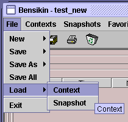 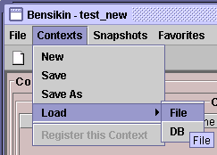

A classic file browser will appear. Search for your “.ctx” file and
select it to load the corresponding context in the {guilabel}`Context Details`
sub panel (See [Figure 6: Context control panel ](#bensikin-fig-6)).

### Printing a context

Once you have context ready, click on the {guilabel}`print` icon ()
and select {guilabel}`context`:

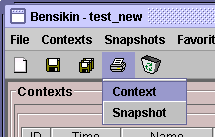

The classic print dialog will then appear. Validate your print
configuration to print an xml representation of your context.

User can also print context by pressing the button 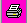

### Saving a context

Once you have context ready, click on the {guilabel}`save` icon ()
and select {guilabel}`context`:

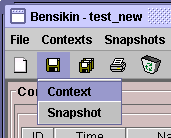

You can also go to menu {guilabel}`Contexts` and click on {guilabel}`save`, or go to
menu {guilabel}`File`, select {guilabel}`Save` and click on {guilabel}`Context`.

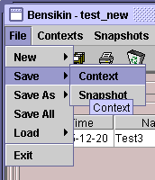 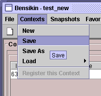

Then, the behavior is “Word-like”. This means that if this is the
first time you save this context, you will see the classic file
browser to choose where to save your context, with file name.
However, else, it will automatically save in the corresponding file.
If you want to save in another file, you have to go to {guilabel}`File` menu,
select {guilabel}`Save As` and click on {guilabel}`Context` or go to {guilabel}`Contexts` menu and
click on {guilabel}`Save As`:

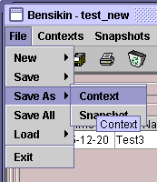
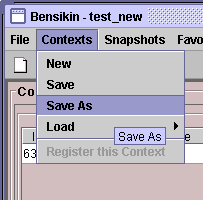

## Snapshot Management

This section describes how to control snapshots with Bensikin. A
Snapshot is a view of your equipment at a precise date, view based on a
context. A Snapshot has an ID, a creation date (Time), and a comment to
describe it (which can be left empty).

Snapshots are managed in the snapshot control panel:

(bensikin-fig-12)=

:::{figure} bensikin/image45.png
Figure 12: Snapshot control panel
:::

(creating-a-new-snapshot)=

### Creating a new snapshot

To create a new snapshot, first select a valid context in the
context control panel (see [Figure 6: Context control panel ](#bensikin-fig-6)). Then
click on the button 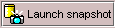. The corresponding snapshot is added
in the list of snapshots in the Snapshot List sub panel.

### Loading a snapshot

There are 2 ways to load a snapshot:

- Load it from the database
- Load it from a file

#### Loading a snapshot from database

Loading a snapshot from database consists in adding this snapshot in
the list of snapshots in the Snapshot List sub panel.

As you can see in [Figure 12: Snapshot control panel ](#bensikin-fig-12),
the {guilabel}`Snapshot List` sub panel allows you to filter snapshots from database to find
the snapshot you want to load. However, have in mind that this
filter is “context dependent”, which means that the snapshots which
will appear in the list by clicking on the {guilabel}`filter` button
(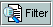) are the one that correspond to your filter criteria
**AND** the selected context in the {guilabel}`Context Control Panel`. If the
filter is cleared (which you can obtain by clicking on the
button 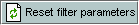), you will search for all the snapshots in
database that correspond to the selected context.

#### Loading a snapshot from file

In the {guilabel}`Snapshots` menu, choose {guilabel}`load` then select {guilabel}`File`, or in
{guilabel}`File` menu choose {guilabel}`load` then select {guilabel}`Snapshot`:

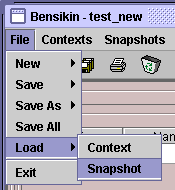 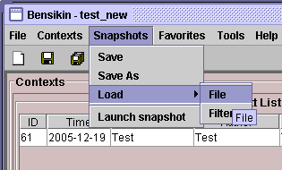

A classic file browser will appear. Search for your “.snap” file and
select it to load the corresponding snapshot in the Snapshot Details
sub panel (See [Figure 12: Snapshot control panel ](#bensikin-fig-12))

### Editing a snapshot

To edit a snapshot, double click on the snapshot you want to edit in
the snapshot list (in the {guilabel}`Snapshot List` sub panel). This will open a
new tab about this snapshot in the Snapshot Details sub panel, tab
named by this snapshot ID. If you load a snapshot from file, the
name of the tab is the name of the file. To differentiate snapshots
loaded from file and the ones loaded from database, the snapshot
loaded from file tabs have the icon .

### Setting equipment with a snapshot

A snapshot allows you to set equipment with its attributes write
values. You can choose which attributes will set equipment, and
which not, by selecting or unselecting the corresponding check box
in the column {guilabel}`Can Set Equipment`
(See [Figure 12: Snapshot control panel ](#bensikin-fig-12)).
By default, every attribute is selected. If you unselect
some attributes, an icon  will appear in tab title to
notify you that these attributes will not set equipments. You can
quick select/unselect all the attributes by clicking on {guilabel}`All`
and {guilabel}`None` buttons. When you are ready to set equipment with the
selected write values, click on the button 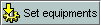.

You can also modify the write value before setting equipment by
editing it in the table. If you do so, the value becomes red and an
 icon appears to warn you about the fact that you made
modifications in this snapshot (these modifications will not be
saved in database, they are just here to set equipment).

(bensikin-fig-13)=

:::{figure} bensikin/image54.png
Figure 13: Modified snapshot
:::

### Snapshot comparison

There are 2 ways to compare snapshots:

- Compare a snapshot with another one:

  To do so, select a tab in Snapshot Details sub panel
  ([Figure 12: Snapshot control panel ](#bensikin-fig-12)).
  Click on button 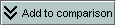. You will
  see the tab title of this attribute appear in the field
  “1{sup}`st` snapshot”. Select another tab and click again on
   button to put this attribute tab title in the field
  “2{sup}`nd` snapshot”. Click then on 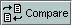 button to see the
  comparison between these 2 snapshots.

  If user wants to see only the first line of comparison, he must
  check filter 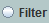

  Else if he/she wants to see all the details of the comparison,
  he/she must check 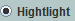

  (bensikin-fig-14)=

  :::{figure} bensikin/image57.png
  Figure 14: Snapshot comparison - full table
  :::

  To print this comparison table, click on {guilabel}`Print` button.

- Compare a snapshot with current state:

  To compare a snapshot with current state, set this snapshot as
  “1{sup}`st` snapshot”, as explained above, and leave the
  “2{sup}`nd` snapshot” empty. Note that once the “1{sup}`st`
  snapshot is selected, you only can update the “2{sup}`nd` snapshot
  or clear the comparison selection. To do so, click on the
  button 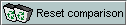. What is hidden behind this is a creation of a
  snapshot, named “BENSIKIN_AUTOMATIC_SNAPSHOT”, and you compare
  this snapshot with your snapshot. Have in mind that this automatic
  snapshot is registered in database. So, in the comparison table, the
  current state will appear as the second snapshot with the name
  “Current state” (red block in the comparison table).

### Snapshot Details copy

As you can see in [Figure 12: Snapshot control panel ](#bensikin-fig-12),
snapshots are detailed in a table. You can copy this table to clipboard as a
text-CSV formatted table by clicking on 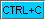 or 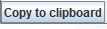
button. If you want to see this text result and may be filter it
(like removing lines), click on 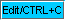 button. You will see the
text appear in a dialog.

(bensikin-fig-15)=

:::{figure} bensikin/image59.png
Figure 15: Snapshot edit clipboard dialog
:::

### Modifying a snapshot comment

Once your snapshot details are loaded, click on 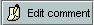 button to
modify its comment (and save it in database or file).

### Printing a snapshot

Once you have context ready, click on the {guilabel}`print` icon ()
and select {guilabel}`snapshot`:

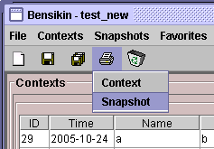

The classic print dialog will then appear. Validate your print
configuration to print an xml representation of your snapshot.

### Saving a snapshot

Once you have context ready, click on the {guilabel}`save` icon ()
and select {guilabel}`snapshot`:

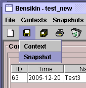

You can also go to menu {guilabel}`Context` and click on {guilabel}`Save`, or go to menu
{guilabel}`File -> Save -> Snapshot`.

Then, the behavior is “Word-like”. This means that if this is the
first time you save this snapshot, you will see the classic file
browser to choose where to save your snapshot, with file name.
However, if not, it will automatically save in the corresponding
file. If you want to save in another file, you have to go to {guilabel}`File`
menu, select {guilabel}`Save As` and click on {guilabel}`Snapshot`, or go to {guilabel}`Snapshots`
menu and click on {guilabel}`Save As`.

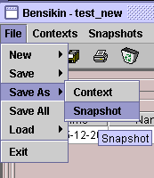 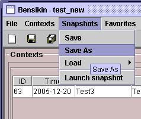

## Favorites

Bensikin manages a list of favorite context, so you can quickly switch
to anyone of them. Those favorites are saved at application shutdown and
loaded on startup.

### Adding a context to favorites

To add a context to your favorites, have your context ready by
creating or loading it. Then go to {guilabel}`Favorites` menu and click on
{guilabel}`Add selected context`.

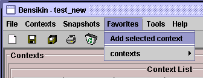

### Switching to a context in favorites

To switch to a context in favorites, which means to load it from
favorites, go to “Favorites” menu, select “contexts”, and click on
the context you want to load.

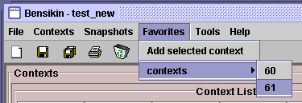

## Options

Bensikin manages global options. Those options are saved at application
shutdown, and loaded on startup. The Options menu is located in the Menu
bar: {guilabel}`Tools -> Options`.

### Application’s history save/load Options

Define whether Bensikin has a history, i.e. a persistent state when
closed/reopened.

If yes is checked, a XML History file will be saved in Bensikin’s
workspace, and on next startup the current Context and Snapshot will
be loaded.

(bensikin-fig-16)=

:::{figure} bensikin/image69.png
Figure 16: Save option
:::

### Snapshot Options

These are the Bensikin Snapshot Options:

(bensikin-fig-17)=

:::{figure} bensikin/image70.png
Figure 17: Snapshot options
:::

- In the Comment Panel, you can choose to automatically set or not a
  value to a new snapshot comment. This means, when you click on
   button, the newly created snapshot will or will not have a
  pre-defined comment.
- In the {guilabel}`Comparison Panel`, you can choose which columns you want to
  show/hide for every block in the Snapshot Comparison table. You can
  choose to show/hide the Difference block too (See
  [Figure 14: Snapshot comparison - full table ](#bensikin-fig-14))
- In the {guilabel}`Export Panel`, you can choose the column separator for your
  text-CSV formatted tables
  (See [Figure 15: Snapshot edit clipboard dialog ](#bensikin-fig-15)),
  and which columns to export.

### Context Options

Context options allow you to select which way you want to edit your
contexts, see [Figure 8: Option –context tab ](#bensikin-fig-8)
and the [Creating a new snapshot ](#creating-a-new-snapshot) section.

### Print Options

The Print option allows you to print text or table in the Snapshots
or in the Contexts.

(bensikin-fig-18)=

:::{figure} bensikin/image71.png
Figure 18: Print option
:::

When you check 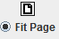, you adapt the size of your print to the
size of your page.

When you check 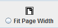, you cut the length of your print on
several parts and the width of your print takes the width of your
page.

When you check 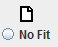, the length and the width of your print
are cut on several parts.

## The Bensikin toolbar

The toolbar is located under the menu bar, and consists mainly of a set
of shortcuts to often used functionalities.

(bensikin-fig-19)=

:::{figure} bensikin/image84.png
Figure 19: Bensikin toolbar
:::

-  is a shortcut to creating a new Context
-  is a shortcut to saving the selected Context/Snapshot into
  a Context/Snapshot file
-  is a shortcut to doing a saving all opened Contexts and
  Snapshots
-  is a shortcut to printing the xml representation of the
  current Context/Snapshot
-  is a shortcut to removing all opened Contexts and
  Snapshots from display
